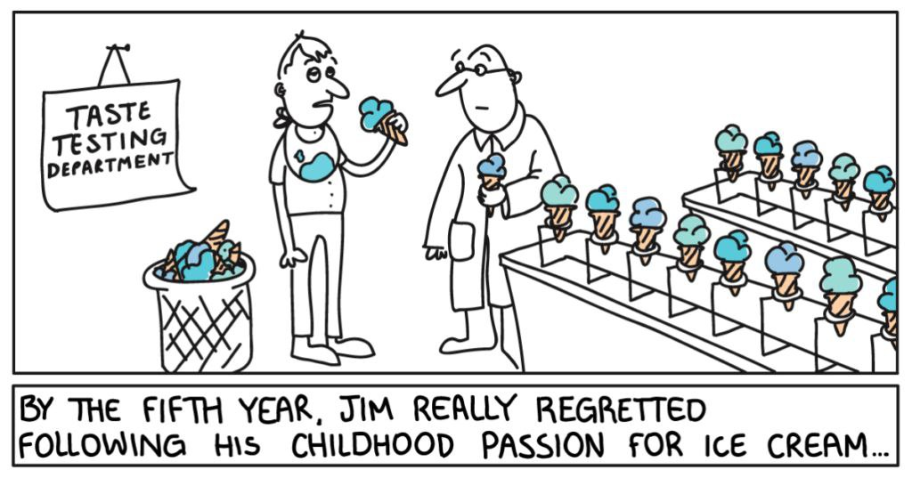
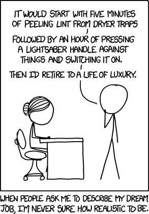
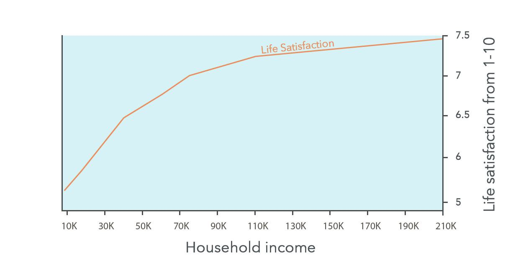
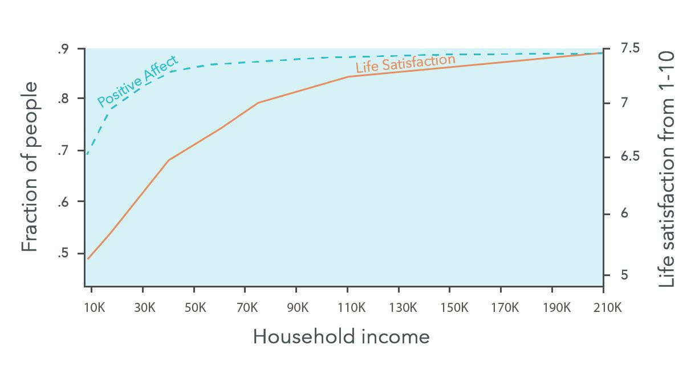
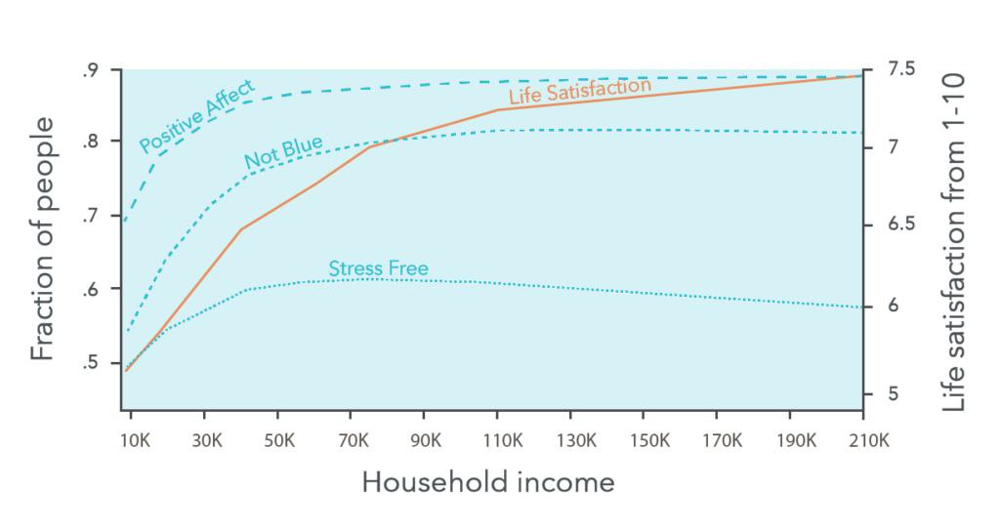
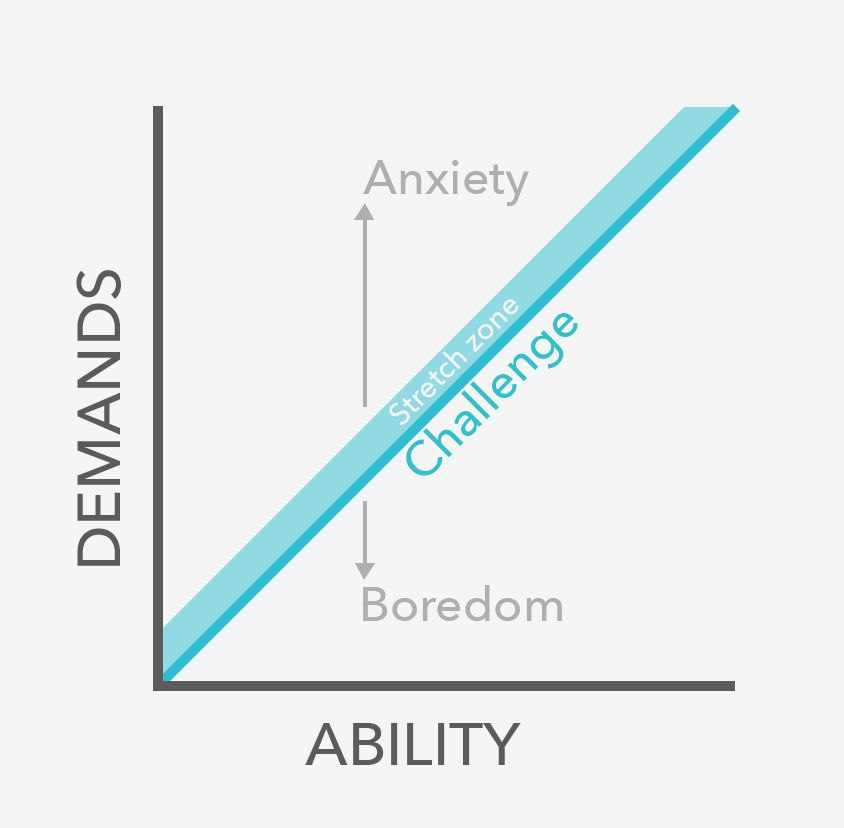
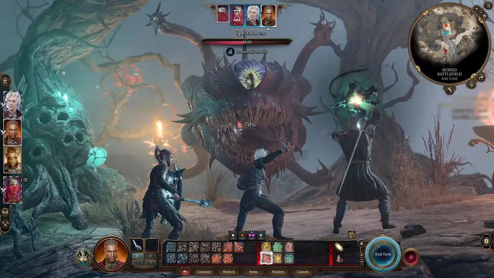
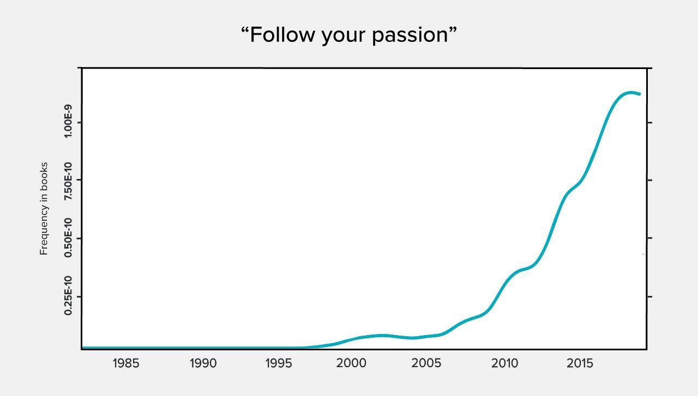
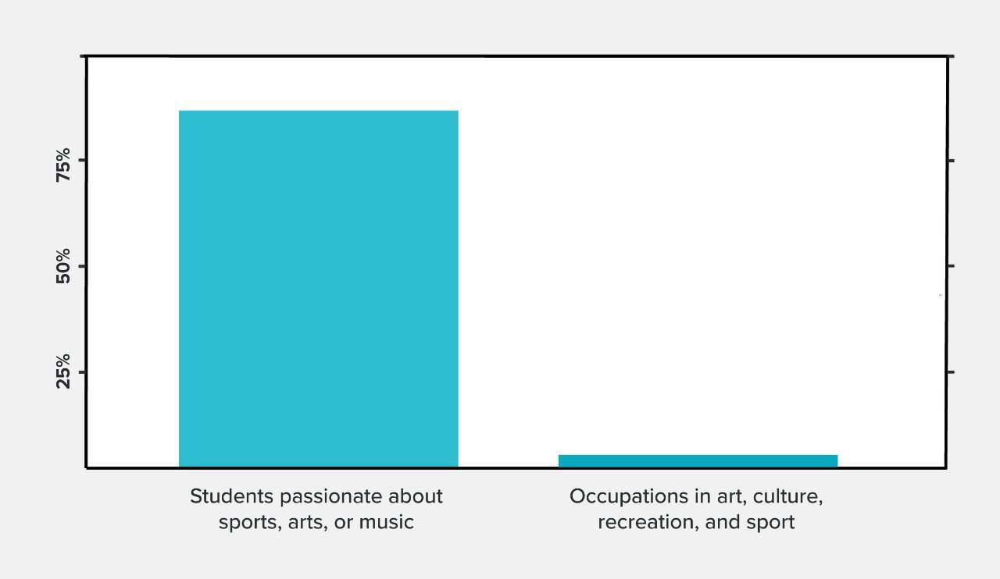

---
title: "مسیر شغلی: از درآمد و خوشبختی تا شغل رویایی"
date: 2025-09-10T12:00:00+03:30
draft: false
categories:

tags:
  - "فلسفه"
  - "شغل"
  - "ترجمه"
  - "سبک زندگی"
  - "شادی و پول"
---

درباره این نمودار میخواستم توضیحات بیشتری بدم. من این نمودار را از سایت [80000 hours](https://80000hours.org/career-guide/job-satisfaction/) برداشتم. این‌ها یک موسسه عام‌المنفعه هستند که در رابطه با مسیر شغلی مطالب جالبی تولید می‌کنند. این دوستان از دانشگاه هاروارد فارغ‌التحصیل شدند و مطالب‌شان دقت علمی زیادی دارد. به قول خودشان ۳۰ سال است که تحقیقات مربوط به این حوزه را مطالعه می‌کنند.  
مطالب‌شان انقدر جالب و مهم بود که به فکرم رسید برخی‌شان را برای دوستانی که حوصله خواندن ندارند، یا حوصله خواندن انگلیسی را ندارند، یا با قلم من حال می‌کنند 😉 خلاصه و ترجمه کنم. اگر عضو هیچ‌کدام از دسته‌های بالا نیستید پیشنهاد می‌کنم خود مطلب را مطالعه کنید.

---

## درآمد و شادی

سال پنجم جیم از دنبال کردن علاقه‌ بچگی‌اش به بستنی واقعا پشیمان شده بود.

---

عموما نصیحت‌های مسیر شغلی که از جانب فردی که سعی دارد واقع‌گرا باشد را می‌شنوید: اینکه برو جایی که پول هست، و احتمالا به شما می‌گوید داروسازی یا دندانپزشکی بخوانید.  

در این رابطه، عموم معیارهای شغل خوب از دید بسیاری از افراد به موارد زیر خلاصه می‌شود:  
- آیا حقوق بالایی دارد؟  
- آیا در آینده حقوق بالایی دارد؟  
- آیا استرس‌آور است؟  
- آیا شرایط کاری ناخوشایندی دارد؟  

در کل اینکه، کاری پردرآمد و راحت باشد، به قول این مقاله *two overrated goals* برای یک شغل مناسب است.

---

پول رضایت از زندگی شما را افزایش می‌دهد اما کمی.  

نمودار بالا میزان رضایتی که افراد از زندگی خود گزارش کردند در کنار درآمد آنها را نشان می‌دهد. همان‌طور که می‌بینید فقط نیم نمره (۶.۵ تا ۷) بین افرادی که ۴۰ هزار دلار درآمد دارند با افرادی که ۸۰ هزار دلار درآمد دارند تفاوت وجود دارد.  

احتمال دارد بگویید: «ببین با این چیزی که تو می‌گویی، اگر درآمد ما را روی این نمودار بیندازی، اتفاقا پول خیلی هم ما را خوشحال می‌کند، چون درآمد ما تقسیم بر یک عدد زیادی که نرخ دلار است می‌شود و ما با پولدارتر شدن از عدد ۵ می‌آییم روی ۶.۵.»  

اما نترسید 🙂 کسی که درآمدش به ریال است، خرجش هم در اکثر اوقات به ریال است. برای مقایسه قدرت خرید ایران و آمریکا از ضریبی به اسم دلار برابری قدرت خرید یا دلار PPP استفاده می‌کنیم. امروز که این مطلب را می‌نویسم هر دلار PPP حدود ۱۵ هزار تومان است. یعنی درآمد حدود ۴۰ الی ۵۰ میلیون تومان در ماه، معادل ۴۰ هزار دلار درآمد سالانه در آمریکا برای یک خانوار است.  

پول بر روی رضایت کلی از زندگی تاثیر دارد (خط نارنجی)، اما بر روی شادی روزانه تاثیر خیلی کمتری دارد.  

منحنی *positive affect* میزان خوشحالی روزانه‌ای که افراد گزارش کردند را نشان می‌دهد.  
رضایت از زندگی، برآورد کلی شما از زندگی خودتان است و از خوشحالی شما در آن لحظه جداست.  

منحنی *not blue* (ناراحت نبودن) در مقابل درآمد افراد را نشان می‌دهد.  
و منحنی *stress free* فقدان استرس را در مقابل درآمد نشان می‌دهد. ارتباط درآمد با استرس از همه متغیرهای دیگر کمتر است.

به عنوان حاشیه میخواستم برای بار آخر بخشی از کتاب انسان خردمند را نقل کنم. این بخش از کتاب آنقدر درخشان نوشته شده که حیفم می‌آمد خلاصه‌اش کنم برای همین عینا آن را اینجا می‌نویسم.

بر اساس نگرش بودیسم اکثر مردم خوشبختی را با احساسات خوشایند و رنج را با احساسات ناخوشایند یکی می‌دانند. از این رو انسان‌ها اهمیت بسیار زیادی برای احساس‌شان قائلند و حریصانه در جستجوی تجربه هر چه بیشتر لذایذ هستند و از درد دوری می‌کنند. هر کاری که در سراسر زندگی خود انجام می‌دهیم خواه خاراندن پا باشد و خواه جابه‌جا شدن روی صندلی فقط در تلاشیم تا به احساسات خوشایند دست‌یابیم.

بر اساس دیدگاه بودیسم، مشکل این است که احساسات ما همچون موج اقیانوس‌ها چیزی بجز ارتعاشات زودگذر نیستند و هر لحظه تغییر می‌کنند. اگر من پنج دقیقه قبل احساس می‌کردم خوشحال و مصمم هستم حالا آن احساس‌ها برطرف شده است و ممکن است غمگین و افسرده باشم. پس اگر می‌خواهم احساسات لذت‌بخشی را تجربه کنم، باید مدام در پی آنها باشم و همزمان احساسات ناخوشایند را از خود برانم. حتی اگر موفق شوم ناچارم بلافاصله از اول شروع کنم بی‌آنکه در ازای زحماتی که متحمل می‌شوم پاداش ماندگاری دریافت کنم. چه چیز مهمی در بهره‌مند شدن از چنین غنیمت‌های زودگذری نهفته است؟ چرا باید برای چیزی تلاش کنیم که به همان سرعتی که پدید می‌آید ناپدید می‌شود؟

طبق نظر بودیسم، ریشه رنج نه احساس درد است و نه اندوه و نه حتی بیهودگی — بلکه ریشه واقعی رنج همین جستجوی بی‌پایان و بیهوده احساسات گذرا است که حالتی از تنش دائمی و بی‌قراری و نارضایتی را در ما به وجود می‌آورد. در نتیجه این جستجوی دائم ذهن ما هرگز به رضایت دست نمی‌یابد. حتی اگر لذت را تجربه کنیم باز ذهن ما راضی نیست زیرا از ناپدید شدن سریع این احساس می‌ترسد. انسان‌ها زمانی از رنج رهایی می‌یابند که به ماهیت ناپایدار تمام احساس‌هایشان پی ببرند و دیگر اشتیاقی به آنها نداشته باشند.

هدف از تمرینات مراقبه بودایی همین است. در مراقبه از شما انتظار می‌رود از نزدیک ذهن و جسم خود را نظاره کنید، شاهد فراز و فرود دائمی تمام احساس‌هایتان باشید و به پوچی جستجوی آنها پی ببرید. وقتی جستجو متوقف می‌شود ذهن به آرامش و شفافیت و رضایت دست می‌یابد. تمام انواع احساسات — خوشی، خشم، ملال، شهوت — همچنان به وجود می‌آیند و می‌گذرند، اما وقتی که به اشتیاق به احساساتی خاص پایان می‌دهید آنها را آنچنان که هستند می‌پذیرید. آرامش به دست آمده چنان عمیق است که کسانی که زندگی‌شان را در کسب دیوانه‌وار احساس‌های خوشایند سپری کرده‌اند نمی‌توانند تصورش را بکنند.

> مثل آن است که مردی ده‌ها سال در ساحل ایستاده است و موج‌های خوب را در آغوش می‌کشد و می‌کوشد از متلاشی شدن آنها جلوگیری کند و همزمان موج‌های بد را به عقب می‌راند و نمی‌گذارد به او نزدیک شوند. مرد هر روز در ساحل می‌ایستد و با این عمل بی‌ثمر خود را به مرز دیوانگی می‌کشاند. سرانجام روی ماسه‌های ساحل می‌نشیند و به موج‌ها کاری ندارد و موج‌ها به میل خود در رفت و آمدند. چه آرامشی!

این نظر چنان برای فرهنگ لیبرال مدرن بیگانه است که وقتی نهضت‌های عصر جدیدی غرب با نگرش‌های بودایی روبرو شدند آنها را به عبارات لیبرالیستی درآوردند و وارونه کردند. آیین‌های عصر جدیدی دائماً می‌گویند که خوشبختی به شرایط بیرونی بستگی ندارد، بلکه فقط منوط است به آنچه در درون خود احساس می‌کنیم. این دقیقاً آن چیزی است که زیست‌شناسان می‌گویند، اما کما بیش عکس آن چیزی است که بودا می‌گفت.

حس می‌کنم که این مطالب فاز مرتاض‌گونه‌ای پیدا کرد. شاید چون مطالب به هم مرتبط بودند این‌شکلی شد، وگرنه اگر از جای دیگری شروع می‌کردم این اتفاق نمی‌افتاد؛ اما حداقل متوجه شدیم مرتاض بودن هم بد نیست 😘

الان با وجود صحبت‌های حضرت بودا این مشکل برای من پیش می‌آید که اصلاً فایده شغل خوب چیه وقتی تمام چیزی که یک انسان برای خوشحالی احتیاج داره یک غاره؟ من خودم را داخل یک چاه انداختم و الان باید تلاش کنم حرف‌هام با نتیجه‌ «خوب بریم غار پیدا کنیم» تموم نشه 😂

جدا از درستی این مطالب من با برداشت لیبرالیستی از حرف‌های بودا هم موافق هستم. از نظر من بودا زمانی که این حرف‌ها را می‌گفته انسان‌ها به صورت پیش‌فرض بیچاره بودند. اوج خوشبختی‌شان در زندگی داشتن غذای کافی بوده و تنها دستاوردی که در زندگی می‌توانستند داشته باشند تعداد نیروی کاری بوده که به جامعه اهدا می‌کردند.

اما امروز انسان‌ها جدا از کسب قدرت و ثروت می‌توانند دستاوردهایی در زندگی داشته باشند که آن‌شکلی که بودا می‌گفت زودگذر نیستند. نمونه‌اش هم انسان‌های بزرگی که در آخرین لحظات زندگی لبخند زدند و بدون هیچ افسوسی از پایان زندگی، فقط خواستار آرامش پس از مرگ بودند. معروف است که کانت در آخرین لحظات زندگی‌اش گفته: *"es ist gut"* (خوب است).

اقرار کانت به رضایت از زندگی در لحظات مرگش برای من نشان از رضایتی ماندگار و نه گذرا دارد. اما چه چیزی بود که باعث شد کانت این جمله را بگوید؟ دنبال کردن علاقه‌اش بود؟ تأثیرگذاری بر دنیا بود؟ این پرسشی‌ست که فکر می‌کنم این مطالب به آن جواب می‌دهند.

در بالا دو محور میزان توانایی و میزان سختی کار را می‌توانید مشاهده کنید. سختی بیش از حد یک مسئولیت باعث اضطراب و راحتی بیش از حداش باعث بی‌حوصله‌گی می‌شود. در این بین مرز باریکی وجود دارد که در اینجا آن را چالش اسم گذاشتند — اما در کتاب‌ها و مطالب خودیاری دیدم که به این موضوع *flow* یا غرقه هم می‌گویند.

حالا که نه پول و نه کار بدون استرس باعث رضایت شغلی می‌شود، بالاخره ویژگی‌های یک شغل خوب چیست؟ مقاله ۶ عامل را برای یک شغل رویایی اسم می‌برد.

**کاری که درگیر کننده (Engaging) باشد**

نه پول نه مزایای یک کار باعث رضایت شغلی نمی‌شود بلکه محتوای کاری است که شما در زمان کار انجام می‌دهید. محتوای کار است که باعث می‌شود شما به کار ادامه بدهید، بی‌حوصله نشید و حقوق پایین را تحمل کنید (نه حقوق خیلی پایین). بازی‌های کامپیوتری نمونه بسیار خوبی از یک کار درگیر کننده و جذاب هستند. کاری درگیر کننده است که ویژگی‌های زیر را داشته باشد:

1. آزادی در نحوه انجام فعالیت
2. وظایف شفاف و مشخص
3. تنوع در وظایف
4. بازخورددهی برای اینکه بفهمید کار چقدر خوب انجام می‌دهید

نتایج تحقیقات نشان می‌دهد که هر کدام از عوامل بالا همبستگی با رضایت شغلی دارند (r=0.4).

با این وجود بازی‌های کامپیوتری کلید یک زندگی رضایت‌بخش نیستند (نه فقط چون پول برای بازی کردن نمی‌دهند). چون شما احتیاج به چیز دیگری دارید...

**کاری که به دیگران کمک می‌کند**

مشاغلی که افراد در آنها خیری به بشر نمی‌رسانند بیشتر کار خود را بی‌معنی توصیف می‌کنند. مثلاً طراحان مد و یا کارگردانان برنامه‌های خبری ویژگی‌های شغل درگیر کننده را دارند اما از شغل خود راضی نیستند چون احساس می‌کنند کارشان بی‌معنی است. اما در عوض پرستارها و جراحان مغز و اعصاب بیشتر کار خودشان را معنی‌دار می‌دانستند و رضایت شغلی بیشتری داشتند.

تحقیق دیگری نشان می‌دهد که در سراسر دنیا افرادی که به خیریه کمک می‌کنند رضایت‌شان از زندگی معادل افرادی با درآمد دوبرابر آنها است.

**کاری که در آن خوب هستید**

مهارت در کار باعث احساس توانمندی در افراد می‌شود. همچنین فردی که در کاری تبحر دارد قدرت چانه‌زنی بیشتری در سایر عوامل یک شغل خوب را دارد. مثلاً می‌تواند پروژه‌هایی را انتخاب کند که برایش معنی‌دار هستند.

خوب بودن در کاری، باعث علاقه‌مند شدن به کار می‌شود. اما برعکس این‌شکلی کار نمی‌کند — مثلاً اگر عاشق هنر و طراحی باشید و استعدادی در آن نداشته باشید، در نهایت یک کار گرافیکی خسته‌کننده برای شرکتی که اهمیتی برای شما ندارد را باید انجام دهید.

اما این به این معنی نیست که حتماً باید کاری که همین الان در آن خوب هستید انجام دهید. یعنی باید حداقل پتانسیل این را داشته باشید که در آن کار مهارت پیدا کنید.

**کاری با همکاران حمایت‌گر**

تحقیقات نشان می‌دهد که داشتن همکارانی که شبیه شما هستند و یا در مشکلات به شما کمک می‌کنند بخش خیلی مهمی از یک کار رضایت‌بخش است. این ویژگی ضریب همبستگی خیلی قابل توجهی با رضایت شغلی دارد (r=0.56).

ضریب همبستگی ۱ بین دو متغیر یعنی دو متغیر یک متغیر هستند. ۰.۵۶ یعنی در بیشتر از نصف مواقع افرادی که همکاران خوبی دارند از شغل‌شون راضی هستند.

**کاری که متناسب با بقیه زندگی شماست**

شغل حتماً نباید شامل همه موارد بالا باشد. ممکن است کاری داشته باشید که فقط از آن امرارمعاش می‌کنید اما کارهای جانبی که انجام می‌دهید برایتان معنی‌دار هستند. یک مثال خیلی معروف می‌تواند انیشتین در سال ۱۹۰۵ باشد — که یک کارمند ساده دفتر ثبت اختراع بود اما در آن سال چند شاخه جدید در علم فیزیک ایجاد کرد.

---

**درنهایت شش ماده تشکیل‌دهنده شغل رضایت‌بخش عبارتند از:**

1. کار درگیرکننده که به حالت غرقه‌گی وارد می‌شوید (آزادی، تنوع، وظایف شفاف، بازخورد)
2. کاری که به دیگران کمک می‌کند
3. کاری که در آن خوب هستید
4. همکاران حمایت‌گر
5. نبود موارد منفی قابل‌توجه، مثلاً ساعت‌های کاری خیلی طولانی یا حقوق غیرمنصفانه
6. متناسب با بقیه زندگی

**آیا باید علاقه‌مون را دنبال کنیم؟**

«علاقه‌ات را دنبال کن» جمله تکراری که این روزها زیاد می‌شنویم. این جمله دو مشکل دارد.

مورد اول اینکه اگر کار مورد علاقه‌تان هیچ‌کدام از ۶ مورد بالا را نداشته باشد شغل رضایت‌بخشی نخواهید داشت. و دنبال کردن علاقه اتفاقاً باعث می‌شود که سخت‌تر به موارد بالا دست پیدا کنید، چون کار مورد علاقه افراد احتمالاً در حوزه بسیار رقابتی قرار دارد.

دوم اینکه باعث می‌شود افراد گزینه‌هاشون را محدود کنند. خیلی راحت یک فرد می‌تونه تصمیم بگیره که به ادبیات علاقه‌منده و تمامی گزینه‌های دیگه‌اش را نادیده بگیرد فقط به خاطر اینکه آن گزینه‌ها در آن لحظه برایش رضایت‌بخش نبودند.

اما در سوی دیگر شما به یک کار علاقه‌مند می‌شوید اگر که به دیگران کمک کنید یا با تمرین در کارتان مهارت پیدا کنید، مسئولیت‌های درگیر کننده داشته باشید یا با آدم‌هایی کار کنید که آنها را دوست دارید. به جای اینکه علاقه‌ای داشته باشید که در طول زمان ممکن است تغییر کند.

---

نتیجه این مطلب طولانی:

مهارت پیدا کردن در کاری که برای دیگران ارزشمند است باعث می‌شود که فرصت‌های شغلی زیادی داشته باشید و بتونید روی بقیه مزایای یک شغل خوب بهتر چانه بزنید. خلاصه اکثر ویژگی‌های یک شغل خوب می‌تونید داشته باشید اگر فقط در کار مهارت داشته باشید.

اما یک ویژگی کار هست که باید جدا در نظر گرفته بشود چون با مهارت خالی بدست نمی‌آید و آن کمک کردن به دیگران است. آدام گرنت در کتاب [بده و بستان](https://taaghche.com/book/80746/%D8%A8%D8%AF%D9%87-%D9%88-%D8%A8%D8%B3%D8%AA%D8%A7%D9%86%D8%9B-%D8%B1%D9%88%DB%8C%DA%A9%D8%B1%D8%AF%DB%8C-%D8%A7%D9%86%D9%82%D9%84%D8%A7%D8%A8%DB%8C-%D8%A8%D9%87-%D9%85%D9%88%D9%81%D9%82%DB%8C%D8%AA) که به فارسی هم ترجمه شده توضیح می‌دهد که اگر وظیفه خودتون را این بدونید که به دیگران کمک کنید، اول دیگران به شما کمک می‌کنند که موفق بشید و بعد انگیزه‌ای که از کمک کردن بدست می‌آورید باعث می‌شود که بیشتر تلاش کنید.

با این وجود اگر که کار شما فقط کمک کردن باشد این به مرور باعث فرسودگی شغلی می‌شود، پس کار باید پنج مورد دیگر که بالا ذکر شد را هم داشته باشد.

**نتیجه نهایی:**  
برای داشتن شغل رویایی خیلی نباید نگران پول و یا پیدا کردن یکتا علاقه ابدی بود. بلکه باید به دنبال مهارت و کاری بود که متناسب برای شما و مفید برای دنیا باشد.

به طور کلی اگر بخوایم مثل جمله کلیشه‌ای «علاقه‌ات را دنبال کن» کل مطلب را در یک جمله خلاصه کنیم آن جمله می‌شود:

> **«در کاری مهارت پیدا کن که به دیگران کمک می‌کند.»**
