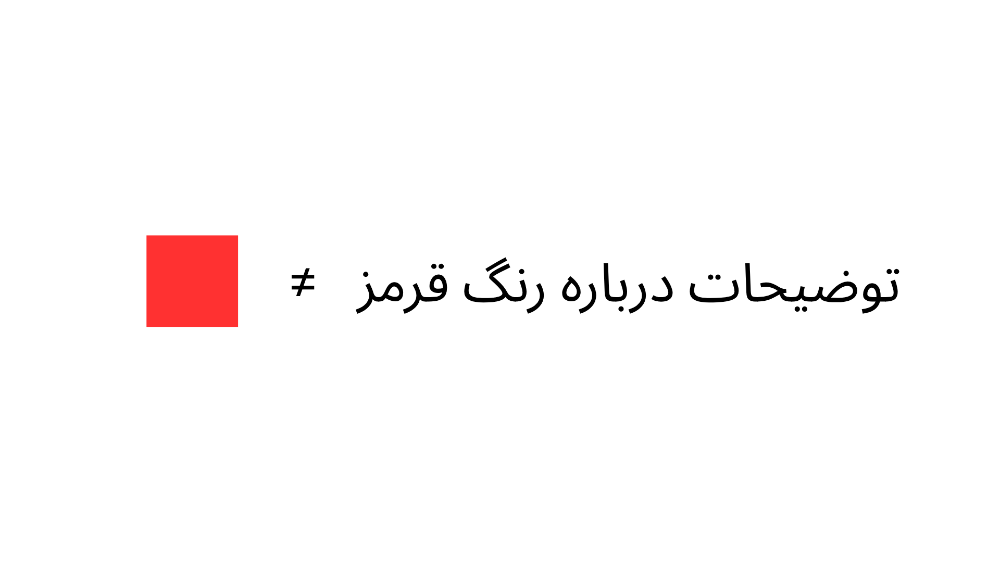

در این پست بیشتر تلاش کردم که نحوه مواجهه خودم با این مسئله را برای شما تعریف کنم. در پست‌های بعد تلاش می‌کنم که کمی عمیق‌تر به این موضوع ورود کنم و آن را توضیح دهم. اگر کمی برای شما تکراری یا خسته‌کننده شد پیشاپیش از شما عذرخواهی می‌کنم. 

زنگ کلاس شیمی دهم بود. معلم داشت درباره رنگ‌هایی توضیح می‌داد که الکترون هنگامی که به مدار پایینتر در اتم می‌رفتند از خود ساطع می‌کردند. معلم باسوادی بود و مطالب را مفهومی تدریس میکرد برای همین من کمی راحت‌تر بودم که سوال‌هایی که داشتم را ازش بپرسم. یادم نیست که آن مطلب دقیقا چند جلسه تدریس شد. در تمامی جلسات فکرم درگیر بود؛ بخشی از ماجرا برایم گنگ بود و احساس می‌کردم که می‌شد یک سوال خوب از آن پرسید اما نمی‌توانستم بفهمم که کجاست. بار اول تلاش کردم که چند کلمه پرت کنم شاید بخش گنگ ماجرا به شکل سوال جاری و ساری شود. دقیقا به یاد ندارم که چه گفتم ولی پت‌پت‌کنان یک چیزی در مایه‌های اینکه "اون چیز(پرتو الکترو مغناطیس)... چیه؟... چرا؟..."  خلاصه که تلاش اول ناموفق بود. یادم نیست که چندبار تلاش کردم که سؤالم را بپرسم ولی در نهایت کمی موفق شدم و پرسیدم که "چرا اون پرتویی که الکترون ساطع می‌شه اون رنگیه؟" ولی جوابی که گرفتم اصلا چیزی نبود که میخواستم بشنوم معلم گفت که "رنگ‌هایی که ما می‌بینیم مکمل هستند یعنی مثلا رنگ قرمز را ما سبز میبینیم..." یکسری از این نوع توضیحات درباره مغز و پردازش تصویر در چشم؛ من که اصلا راضی نشده بودم و منظورم منتقل نشده بود خیلی با ذوق به میز اشاره می‌کردم و می‌گفتم "نه یعنی... چرا این رنگ؟" معلم کمی مکث کرد به بالا نگاه کرد و به تدریسش ادامه داد. من از اینکه جواب نگرفتم ناراحت نبودم بلکه خیلی خوشحال بودم که بالاخره توانستم سوالی که پس سرم بود را بپرسم. 

چند وقتی از این ماجرا گذشت تا اینکه اولین مواجه‌ام را با این موضوع داشتم. اولین برخورد من با ادبیات این موضوع در یکی از برنامه‌های پرگار BBC فارسی بود. برنامه‌ای به اسم دوگانه جسم و روح که در آن دو فیلسوف و یک متخصص اعصاب را برای گفت‌گو در درباره این موضوع دعوت کرده بودند.

این برنامه با اینکه 11 سال از ساختش می‌گذرد و تعدادی از حرف‌هایی که در آن گفته می‌شود نادرست است هنوز مناظره جذاب و قشنگی برای تماشا است. به صورت کلی برنامه‌های مناظره‌ای پرگار ورزش‌های فکری خوبی هستند فقط اگر که زمان تماشا مناظره فقط به دنبال تایید دیدگاه خود نباشیم و استدلال‌ها را دنبال کنیم تا ببینیم ما را به کجا می‌برند و یک نکته‌ی دیگر اینکه من درباره "مناظره‌ها" صحبت می‌کنم، نه "گفت‌گوها" بعضی از برنامه‌های پرگار به این شکل است که درباره یک موضوعی گفت‌گو می‌کنند و آن را توضیح می‌دهند بدون اینکه تقابلی در دیدگاه‌های مهمانان باشد.

بگذریم در این برنامه یکی از مهمانان سوال من از معلم شیمی را می‌پرسد: چرا احساس خارش چنین احساس بخصوصی را دارد؟ یا مثلا چرا رنگ‌ قرمز چنین کیفیتی دارد؟ و توضیح می‌دهد علم برای اینکه به این سوالات پاسخ دهد با یک مشکل ساختاری روبه‌رو است. اینکه دیدگاه علم سوم شخص است و رنگ قرمز یک احساس اول شخص است. یعنی علم می‌تواند یک شخص عصبانی را توصیف کند بگوید اعصاب کجای مغز فعال می‌شود، فرد چه ویژگی‌های رفتاری را از خود بروز می‌دهد... اما نمی‌تواند بگوید که شخص عصبانی بودن چه کیفیتی یا چه احساسی دارد.

یک مثال دیگر می‌توانید به این فکر کنید که چه‌ طور می‌توانید به انسان کور مادرزاد دیدن رنگ قرمز را توضیح دهید؟ اگر کمی به این سوال فکر کنید احتمالا به این نتیجه می‌رسید که این کار امکان‌پذیر نیست. توضیحات شما درباره رنگ قرمز با خود رنگ قرمز متفاوت است و توضیحات شما نمی‌تواند تجربه رنگ قرمز را به آن فرد منتقل کند. هر چقدر درباره ویژگی‌های فیزیکی رنگ قرمز توضیح بدهید یا درباره نحوه پردازش تصویر در مغز یا چشم بگید این توضیحات هیچ کدام علت قرمز بودن رنگ قرمز را توضیح نمی‌دهد.

رنگ قرمز از جنس کیفیات ذهنی(qualia) است. معمولا خارجی‌ها وقتی این موضوع را توضیح ‌می‌دهند احتمالا بخاطر تراژیک شدن ماجرا  از مثال کور مادرزاد استفاده نمی‌کند و به‌جایش یک داستان از شخصی به اسم مری تعریف می‌کنند که همه چیز را درباره فیزیک، شیمی و عصب‌شناسی می‌داند و در یک اتاق سیاه و سفید زندگی میکند تا این که روزی از اتاقش خارج می‌شود و یک سیب قرمز را می‌بیند. بعد می‌پرسند که آیا مری اطلاعات تازه‌ای از مشاهده سیب قرمز بدست می‌آورد؟ و جواب می‌دهند مری با اینکه همه چیز را درباره علوم می‌داند اما با دیدن رنگ قرمز اطلاعات جدیدی بدست می‌آورد؛ اطلاعاتی که دانستن همه‌چیز درباره مغز باعث نشده بود که آن را بفهمد یا بدست بیاورد.

به قول دنیل دنت(Daniel Dennett) تجربه رنگ قرمز یا بصورت کلی‌تر آگاهی، آخرین معمای بازمانده بشر است.[1] دنت می‌گوید که ما نحوه فکر کردن درباره تمامی سوالات بشر را می‌دانیم و با دانستن آن تقریبا از تمامی آنها معمازدایی کردیم. ما تقریبا می‌توانیم بگویم که انسان از کجا آمده‌. ستاره‌ها از چی ساخته شده‌اند. زمین چگونه شکل گرفته. اما آگاهی و احساس اول شخص آخرین سوال‌های بی‌پاسخ بشر است که هنوز نحوه فکر کردن درباره آن را نمی‌دانیم. عده‌ای دوست دارند که معما باقی‌بماند تا جهان جذابیت عرفانی خودش را حفظ کند. دنت اما باور دارد که حتی اگر ذره‌ای از جذابیت جهان کم کند ما می‌توانیم این جذابیت را با زیبایی فهمیدن جهان معاوضه کنیم.  

---
1. [Consciousness Explained](https://www.amazon.com/Consciousness-Explained-Daniel-C-Dennett/dp/0316180661)
