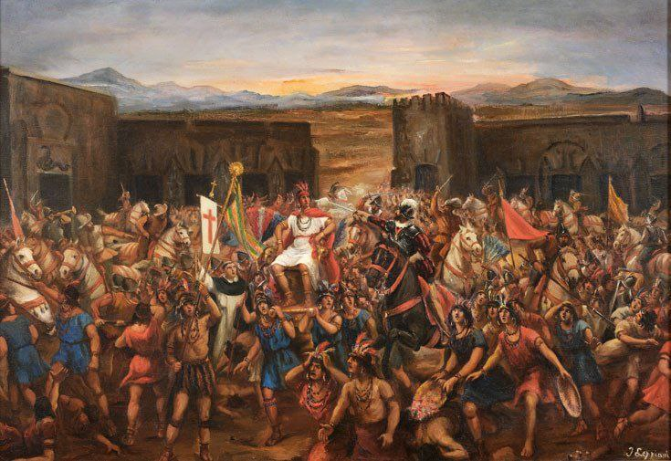
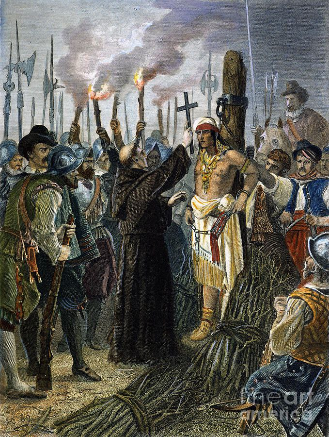

---
title: "خلاصه کتاب اسلحه، میکروب و فولاد"
date: 2025-10-08T21:49:00+03:30
draft: false
categories:
  - "خلاصه کتاب"
  - "تصویر بزرگ"
tags:
  - "خلاصه کتاب"
  - "تاریخ"
  - "رشد اقتصادی"
---

## پیسارو و امپراطوری اینکا
برای شروع قصد داشتم با داستانی به نظر بی‌ربط به رشد اقتصاد از کتاب «اسلحه، میکروب و فولاد» شروع کنم.

پیسارو فرستاده امپراطور مقدس روم بود که در سال ۱۵۳۲ به آمریکای جنوبی رسید. در آن زمان بزرگ‌ترین و قدرتمندترین امپراطوری دنیای نو (قاره آمریکا) اینکاها بودند.

فرماندار پیسارو با شکنجه بعضی از سرخ‌پوست‌ها، محل فرماندهی امپراطوری اینکاها — شهر کاخامارکا — را کشف کرد. آنها به سمت این شهر حرکت کردند و وقتی که رسیدند از جمعیت و تعداد چادرهای این شهر حیرت‌زده و وحشت‌زده شدند. امکان برگشت و تجدید قوا نداشتند چون از نزدیک‌ترین قرارگاه اسپانیایی‌ها چند هزار کیلومتر فاصله داشتند.
وارد شهر شدند. شب را در میدان اصلی شهر ماندند. از شدت ترس هیچ‌کدام نخوابیدند و تا صبح نگهبانی دادند.

صبح که شد، قاصدی وارد شد و به پیسارو اطلاع داد که امپراطور به هر شکل، در هر زمان، مانند یک دوست با شما دیدار خواهد کرد.
پیسارو تفنگدارانش را به دو گروه تقسیم کرد و تعدادی توپ را داخل قلعه کوچک وسط میدان قرار داد. سوارکاران را هم در پشت حصیری پنهان کرد.
ظهر، تمام دشت پر از سرخ‌پوست شد. ابتدا هیئت همراه امپراطور وارد میدان شد — هیئت مفصلی که از محافظان، رقاصان و آوازخوانان تشکیل شده بود. پس از آنها افرادی با زره و تاج‌های طلایی‌نقره‌ای وارد شدند که اسباب و وسایل طلایی زیادی حمل می‌کردند. در بین آنها آتوآلپا، امپراطور اینکاها، جای داشت که بر روی تخت روانِ ظریفی نشسته بود که چهارچوبش با نقره پوشیده شده بود.
سربازان پیسارو که به ۳۰۰ نفر نمی‌رسیدند از شدت ترس و عظمت هیئت همراه امپراطور و ۴۰ هزار سرباز سرخ‌پوست، خودشان را خیس کرده بودند.

پیسارو کشیشی به پیش امپراطور فرستاد تا موعظه‌اش کند. کشیش بین سرخ‌پوستان رفت و گفت:
> «من کشیش خدا هستم، به مسیحیان درباره خدا آموزش می‌دهم. از تو می‌خواهم که دوست خدای مسیحیان شوی، چرا که این اراده خداست و خیر تو در آن است.»
آتوآلپا انجیل را خواست تا نگاهی به آن بیندازد. کشیش انجیل را بست و آن را به آتوآلپا داد. آتوآلپا انجیل را گرفت، نمی‌دانست چه شکلی آن را باز کند. کشیش دستش را برای باز کردن کتاب پیش برد، اما امپراطور عصبانی شد و بر روی دست کشیش زد و خودش لای کتاب را باز کرد. به جای اینکه از حروف داخل کتاب تعجب کند، عصبانی شد و انجیل را بر روی زمین پرت کرد.
پدر روحانی پیش پیسارو بازگشت و فریاد زد:
> «بیرون بیایید! ای مسیحیان! این مستبد کتاب مقدس را به زمین پرتاب کرده. به این سگ‌های دشمن که کلام خدا را انکار می‌کنند بتازید! به او حمله‌ور شوید! من شما را می‌آمرزم!»
فرماندار به سربازانش علامت داد. ترمپت‌ها نواخته شدند. سوارنظام و پیاده‌نظام از مخفیگاه خود خارج شدند و به سوی سرخ‌پوستان حاضر در میدان حمله‌ور شدند.

صدای جق‌جقه و ترمپت و انفجار تفنگ‌ها سرخ‌پوستان را به وحشت فرو برده بود. چنان ترسیده بودند که با بالا رفتن از روی سر هم پشته‌هایی درست کردند و بسیاری زیر دست و پا خفه شدند. چون اسلحه نداشتند، بدون اینکه گزندی به هیچ یک از مسیحیان برسد به آنها حمله می‌کردند. سوارنظام آنها را له می‌کرد، می‌کشت یا مجروح می‌کرد.

خود فرماندار خنجرش را برداشت، به انبوه سرخ‌پوستان زد و خود را به تخت آتوآلپا رساند. بازوی چپ آتوآلپا را گرفت و فریاد کشید: «سانتیاگو!» (اسم قدیس مسیحی). اما نتوانست آتوآلپا را از تخت پایین بکشد، چون حاملان تخت‌روان آن را بالاتر برده بودند.

هر چه افراد زیر تخت را می‌کشتند، افراد دیگری جایگزین می‌شدند — تا اینکه هشت سوارنظام اسپانیایی به سمت تخت رفتند و آن را به سمت خود کج کردند. به این طریق آتوآلپا اسیر شد.
تا شب، هفت هزار سرباز سرخ‌پوست را کشته و تعداد بیشتری دست یا پایشان را قطع کرده بودند.

پیسارو زندانی خود را ۸ ماه در اسارت نگاه داشت و در ازای آن بزرگ‌ترین باج تاریخ را از اینکاها دریافت کرد. او پس از آنکه به اندازه اتاقی در ابعاد ۶.۵ در ۵ متر و به ارتفاع ۲.۵ متر طلا تحویل گرفت، زیر قول خود زد و آتوآلپا را اعدام کرد.

اما تمام این‌ها بخش خیلی کوچکی از قتل‌هایی بود که اروپایی‌ها باعث آن شدند. بیشتر جوامع بومی آمریکا توسط بیماری‌هایی که از مهاجران اروپایی به آنها منتقل شد کشته شدند.
آبله، تیفوئید، آنفلوانزا، تیفوس، سرخک و طاعون خیارکی باعث شدند که **۹۵ درصد** از اهالی بومی آمریکا به کام مرگ کشیده شوند. هر کدام از این بیماری‌ها سالیان سال باعث کشته شدن افراد زیادی در اروپا و آسیا شده بود. وقتی اهالی بومی آمریکا با همه این بیماری‌ها یکجا مواجه شدند، بدن آنها هیچ ایمنی در مقابلشان نداشت.
شیوع این بیماری‌ها در امپراطوری اینکا هم باعث هرج‌ومرج و جنگ داخلی شد — و منجر شد اسپانیایی‌ها هنگام حمله با امپراطوری تکه‌تکه روبه‌رو شوند.

## کتاب «اسلحه، میکروب و فولاد» درباره چیست؟
برخی از سوالات هستند که آنقدر مهم هستند که کسی جرئت پرسیدن آنها را ندارد. از آنجا که این سوالات همیشه جلوی چشم افراد هستند، همه فکر می‌کنند جواب آنها را از قبل می‌دانند.
سوال‌هایی مثل اینکه:
- **چرا سیب از درخت افتاد؟ چرا از درخت به بالا نرفت؟**
به نظر من سوالی که این کتاب تلاش به جواب دادن آن می‌کند سوالی از این جنس است. نویسنده (جرد دایموند) در این کتاب تلاش می‌کند به این سوالات پاسخ دهد:
- چه چیزی باعث توسعه می‌شود؟
- چرا برخی از مناطق توسعه‌یافته‌تر از سایر مناطق جهان هستند؟
- چرا برخی از مناطق متمدن‌تر هستند؟
با اینکه داستان تاریخی بالا بخش بسیار کوچکی از کل کتاب ۵۰۰ صفحه‌ای است، می‌توانیم آن را توضیحی برای این سوالات بدانیم:
- چرا اینکاها از وجود اسپانیایی‌ها خبر نداشتند، اما اسپانیایی‌ها از وجود آنها خبر داشتند؟
- چرا اسپانیایی‌ها تفنگ و شمشیر داشتند، اما اینکاها نداشتند؟
- چرا اسپانیایی‌ها اسب داشتند؟
- چرا اسپانیایی‌ها در مقابل بیماری‌های بومیان ایمن بودند، اما بومیان در مقابل بیماری‌های آنها ایمن نبودند؟
- چرا اسپانیایی‌ها کشتی داشتند؟
- چرا اسپانیایی‌ها خط و کتابت داشتند؟

در نهایت، چرا توسعه در اوراسیا اتفاق افتاد و نه در آمریکا؟
این کتاب تلاش می‌کند به این سوالات پاسخ دهد.

