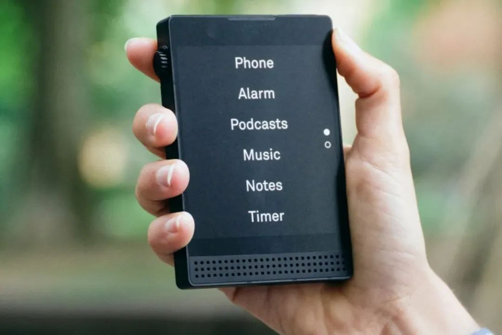
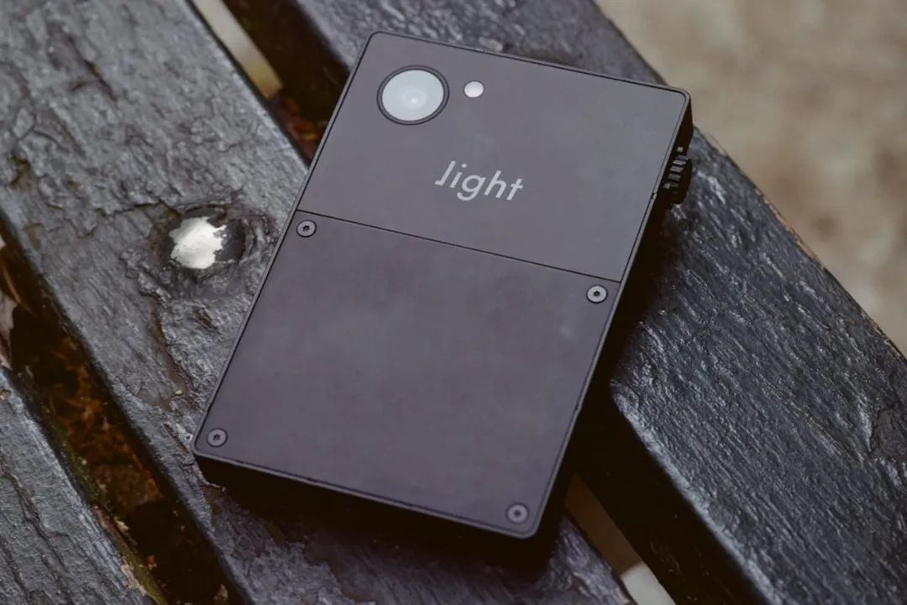
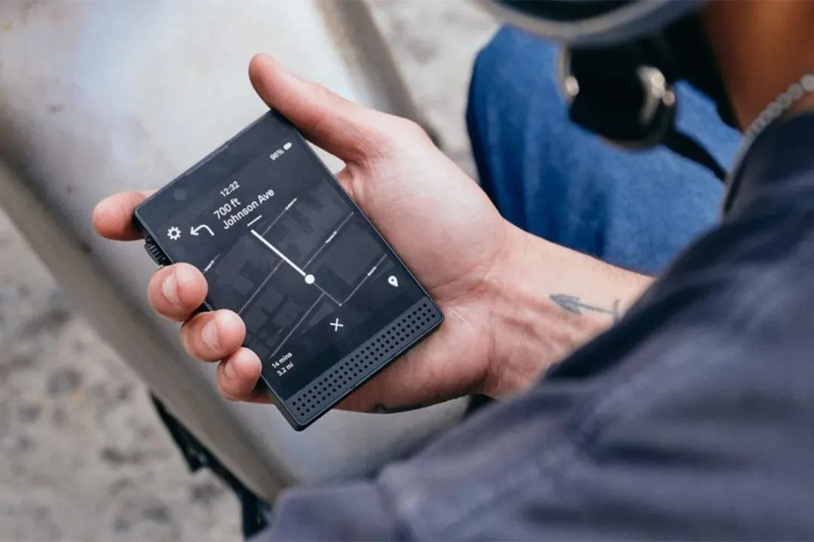
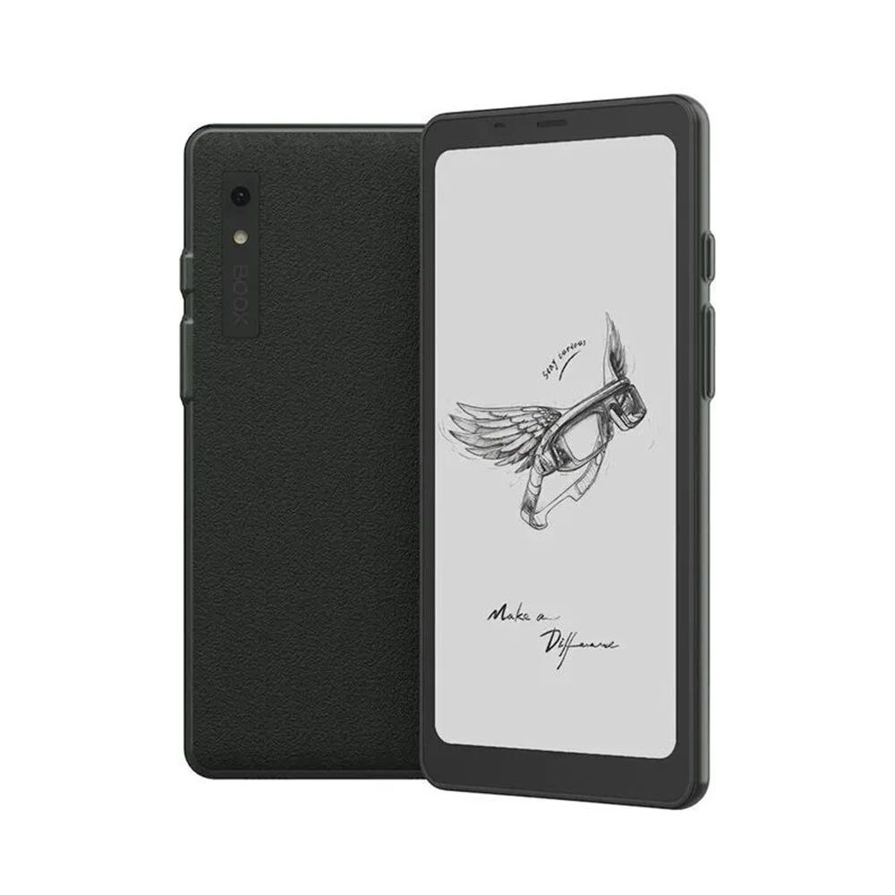
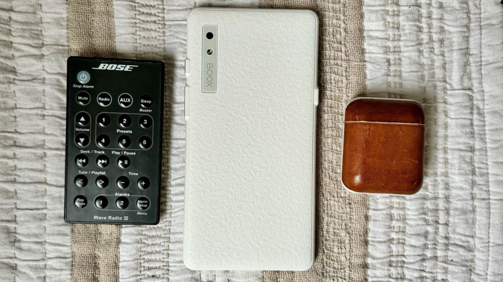
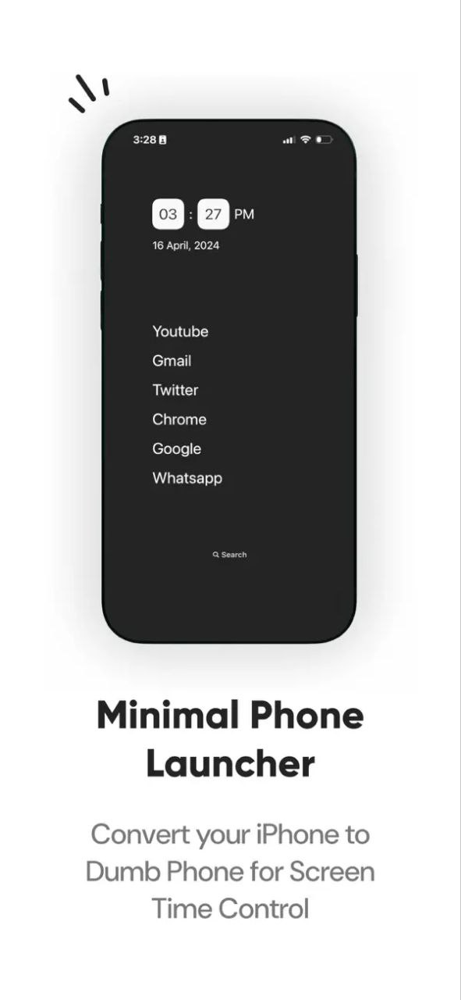

---
title: "مینیمالیسم دیجیتال"
date: 2025-08-17T08:23:00+03:30
draft: false
categories:
  - "تکنولوژی"
tags:
  - "مینیمالیسم"
  - "بهره‌وری"
  - "سبک زندگی"
---

## چرا مینیمالیسم دیجیتال؟
کلمه مینیمالیسم دیجیتال را از روی یک کتابی به همین اسم برداشتم و قصد داشتم کمی از راهکارهایی که من در این رابطه استفاده می‌کنم را براتون بنویسم.
زندگی روزمره ما از هر زمانی بیشتر به تسخیر گوشی‌های هوشمند درآمده به طوری که اگر کارهایی که با گوشی هوشمند انجام می‌دید را لیست کنید بعیده که در نوشتن تمام کارکردهای آن موفق بشید.
این موفقیت و کارایی موبایل‌ها عده‌ای را به نتیجه جالبی رساند. به این نتیجه که شاید اصلاً بدتر بهتر باشد. چون برای حل این مشکل نمی‌توانیم با دور ریختن گوشی‌ها به آغوش زندگی بازگردیم، چون بعد متوجه می‌شویم که چیزی برای خوردن نداریم.
برای همین عده‌ای به فکر افتادند که گوشی بسازند که به اعتیادآوری گوشی‌های مرسوم نباشد و کمی از کارایی آنها را حفظ کند. من چند نمونه از این تلاش‌ها را براتون می‌گذارم:
- **Light Phone 3** — صفحه نمایش کاغذ دیجیتال (مثل کتابخوان‌ها) و فقط ۶ برنامه دارد.

- **Boox Palma** — از اندروید پشتیبانی می‌کند و نرم‌افزارهای بیشتری می‌شود نصب کرد، اما سیم‌کارت نمی‌خورد.

---
## لانچرهای مینیمال
ولی احتمالاً تا الان با خودتون گفتید که این‌ دیگه خیلی بدردنخوره، من ترجیح می‌دم که انگشتام با اسکرول کردن فلج بشند تا اینکه با تکنولوژی عصر پدربزرگم زندگی کنم.
من برای این افراد و انگشتانشون توصیه‌ای دارم که شاید مفید باشد: نصب کردن **لانچر یا UI های مینیمال**.
این لانچرها چندین فایده دارند:
۱. با کم کردن جذابیت محیط گوشی، اعتیاد و حواس‌پرتی را کم می‌کنند.
۲. باعث می‌شوند فقط در صورتی که کار مهمی دارید گوشی را باز کنید و فقط به سراغ همان یک کار بروید.
۳. می‌توانید برای ورود به بعضی اپ‌ها مثل اینستاگرام «باز شدن با تأخیر» تنظیم کنید — یعنی ۱۵ ثانیه بعد از کلیک، باز شود.
*(یک لحظه احساس کردم دارم مازوخیسم ترویج می‌کنم 😶)*
---
## لیست لانچرهای پیشنهادی
برنامه‌های لانچر زیادی هست که می‌تونید نصب کنید. من خودم وابستگی زیادی به این برنامه‌ها پیدا کردم به شکلی که اگر روی حالت عادی گوشیم کار کنم احساس شلختگی و حواس‌پرتی زیادی می‌کنم:
1. [Olauncher — Minimal AF Launcher](https://play.google.com/store/apps/details?id=app.olauncher) — من جدیداً از این استفاده می‌کنم.
2. [Oasis — Minimal App Launcher](https://play.google.com/store/apps/details?id=com.crimson.oasislauncher)
3. [Zen Detox: Minimalist Launcher](https://play.google.com/store/apps/details?id=com.zen.detox)
4. [Minimalist Phone](https://www.farsroid.com/minimalist-phone/) — نسخه اصلی پولی است. یک چند ویژگی دارد که در بقیه ندیدم، مثل باز شدن با تأخیر، ولی چون کرک شده امنیت بقیه برنامه‌ها را ندارد.

---
## خاموش کردن نوتیفیکیشن‌ها
پیرو بحث مینیمالیسم دیجیتال، این مطلب را دیدم که خیلی خوب در این موضوع می‌گنجید و مدت‌هاست که روی گلویم سنگینی می‌کرد. با اینکه بعضی از این مطالب تحقیقات زیادی درباره آنها انجام شده، اما من چون سواد و حوصله ارجاع به آنها را ندارم، طبق معمول این مطالب را نظرات شخصی من در نظر بگیرید.
> اگر همه چیز را انتخاب کنید، عملاً هیچ چیز را انتخاب نکردید.
این جمله در جاهای بسیاری مصداق دارد. در خصوص نوتیفیکیشن‌ها: اگر به تمامی برنامه‌ها دسترسی به اعلانات گوشی‌تان را بدید، عملاً به هیچ برنامه‌ای دسترسی نداده‌اید، چون ۸۰۰ تا اعلان بدردنخور دارید که اگر تک‌توکی اعلان بدرد‌بخوری بین آنها بود (که نیست) در انبوه اعلانات گم شده.
این نکته خیلی بدیهی به نظر می‌رسد ولی من تا به امروز افراد خیلی کمی دیده‌ام که دست به تنظیمات نوتیفیکیشن‌شون زده باشند.
اگر بخوام نظر شخصیم را هم بگم: من حتی دسترسی دادن به برنامه‌های مهم را هم درست نمی‌دونم. فکر نمی‌کنم افراد زیادی باشند که چند ساعت دیرتر پاسخ دادن یک پیام تغییری در زندگی آنها ایجاد کند. معمولاً پیام دادن به خودی خود به این معنی است که کار آنچنان جدی نیست که احتیاج به پاسخ بلادرنگ داشته باشد.
فواید خاموش کردن اعلانات این است که حواس‌پرتی کمتری دارید و وقت کمتری در گوشی صرف می‌کنید — چون فقط به خاطر یک کار بخصوص به سراغ گوشی خود می‌روید، نه اینکه در گوشی رها بشید تا ببینید امواج نوتیف‌ها شما را به کجا می‌برند.
